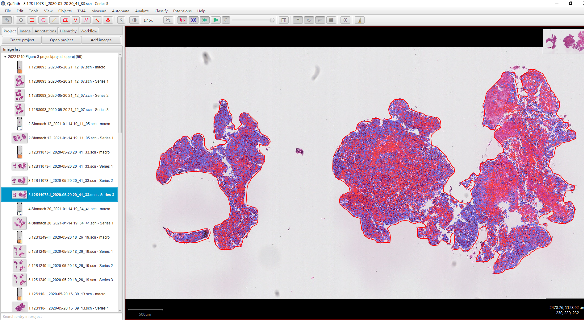

# Prioritization on whole slide images of clinical gastric carcinoma biopsies through a weakly supervised and annotation-free system

This repository provides training and testing scripts for the article "Prioritization on whole slide images of clinical gastric carcinoma biopsies through a weakly supervised and annotation-free system".

## Using QuPath to generate the WSI images and cellular features

We use the QuPath(0.2.0-m8) [Link](https://qupath.github.io/) to generate the WSI images and cellular features for training and validation.

The capture of working space is shown below:

To run the scripts, please open the script editor via `Automate->Show script editor` and load the script for running.

If you want to extract the WSI images and features using own data, please follow the steps below:

### Extract the WSI Images

For extracting the images, use QuPath script `QuPath_Script\ImagesExport.groovy`.

**Modified Line(please fill the path for saving the extracted images)**:

Line 7: `path="images/" // Please Change the Path`

**Script outputs**:

* **(WSI Images).png**: *.png* file which are the extracted WSI images corresponded with scn files.

### Extract the cellular features

For extracting the cellular feature, use QuPath script `QuPath_Script\CellularFeaturesExtractionforWholeSlide.groovy` .

**Modified Line(please fill the path for saving the extracted features)**:

Line 92: `save_path = "Feature/"  //CHANGE sve path here`

**Script outputs**:

* **(WSI cellular features).txt**: *.txt* file which contains the extracted 41 features for data.

## Generation of tile data for training and validation

After using QuPath to generate the cellular features, if you want to generate the tile data for the GastrolFlow training and validation, please follow the steps below:

**Step 1**: run `QuPath_Script\stage_2.py`

**Modified Line(please fill the path for the path of cellular features of slides)**:

Line 9: `ex1 = "./2022Gastrointernaldataraw/RAW_TXT-SET_20200520/"`

**Modified Line(please fill the path for the path of saving)**:

Line 17: `saving_path="./Training_tile/"`

**Setting of the range of tile ratio**:

Line 10: `tile_ratio = [500]`

**Step 2**: run `QuPath_Script\tile.py`

**Modified Line(please fill the path for the path of step 1 saving path)**:

Line 9: `ex1 = "./Training_tile/RAW_TXT-SET_20200520/"`

**Modified Line(please fill the path for the path of saving)**:

Line 20: `df.to_csv("./RAW_TXT-SET_20200520_tiledata_{}.csv".format(r), index=False)`

**Script outputs**:

* **(WSI cellular features)_tiledata.csv**: *.csv* file which contains the extracted 41 features for tile data.

## Data for Cross-Validation, External Validation

* Cross-Validation Data: [Internal Data](https://connectpolyu-my.sharepoint.com/:u:/g/personal/21118855r_connect_polyu_hk/EYlJePFwtM1GpSknK0adq18BDO7zwOF63QHHfGkmQqa9Xw)

* External Validation Data: [External Data](https://connectpolyu-my.sharepoint.com/:u:/g/personal/21118855r_connect_polyu_hk/EQFpIguoZMpHgaCPkJpEEokBTdYUON7_JTXRQa046HFEKQ)

* Retrospctive: [Retrospective Set](https://connectpolyu-my.sharepoint.com/:u:/g/personal/21118855r_connect_polyu_hk/EYtw2btVoQNOgcdiw3gCu4oBOayIsqlA6Ek0gQzljDWotA)

## Machine Learning Algorithms

We provide the running scripts of machine learning algorithms in Cross-Validation and External dataset.

### Cross-Validation

To run the machine learning algorithms in Cross-Validation, please follow the steps below: 

**Step 1**: run `machinelearn_internal.py`

**Modified Line(please fill the path for the data. Please note that the Cross-Validation needs to modified the Fold manually)**:

Line 111,114,131: `folder_path=r"Network_result//"`,`data = pd.read_csv(Train_data_path+'train_cross10.csv')`,`data2 = pd.read_csv(Train_data_path+'test_cross10.csv')`

**Modified Line(please fill the path for saving the results.)**:

Line 112: `Result_path=""`

**Script outputs**:

* **(Machine Learning Algorithm).csv**: *.csv* file which contains the predicted results of machine learning models for internal data.

**Step 2**: run `Machine_learning_internal_generation.py`

**Modified Line(please fill the path for the data. Please note that the Cross-Validation needs to modified the Fold manually)**:

Line 4,17: `csv_data=pd.read_csv(r"Internal/K-SVM.csv")`,`csv_data=pd.read_csv(r"801010/final_training_gt.csv")`

**Modified Line(please fill the path for saving the results.)**:

Line 76: `final.to_csv(r"internal_result/K-SVM.csv")`

**Script outputs**:

* **(Machine Learning Algorithm).csv**: *.csv* file which contains the triage list of machine learning models for internal data. 

In this section, it does not contain the scores. If you want to generate the score for calculating AUC or finding priorities, please turn to section **External Dataset, Internal Dataset for Score**.

### External Dataset, Internal Dataset for Score

To run the machine learning algorithms in External Dataset, or generating the score in Internal Dataset, please follow the steps below: 

**Step 1**: run `machinelearn_external_score.py`

**Modified Line(please fill the path for the data. Please note that the Cross-Validation needs to modified the Fold manually)**:

Line 116,135,277,279: `data = pd.read_csv('trainingdata.csv')`,`data2 = pd.read_csv('data/EX1_EX2_SlideData_withgt.csv')`,`data = pd.read_csv('data/EX1_EX2_SlideData.csv')`, `ref_data = pd.read_csv("data/GroundTruth_ex1_2.csv")`

**Modified Line(please fill the path for saving the results.)**:

Line 114: `result_path="external/"`

**Script outputs**:

* **(Machine Learning Algorithm).csv**: *.csv* file which contains the predicted results of machine learning models for external data.

**Step 2**: run `Machine_learning_external_generation.py`

**Modified Line(please fill the path for the data. Please note that the Cross-Validation needs to modified the Fold manually)**:

Line 4,13,63: `csv_data=pd.read_csv(r"SVM--linear/report_pos_.csv")`,`csv_data=pd.read_csv(r"Ground_Truth/GroundTruth_ex1_2.csv")`, `csv_data=pd.read_csv(r"SVM--linear/requireTile_.csv")`

**Modified Line(please fill the path for saving the results.)**:

Line 115: `final.to_csv(r"external_result/SVM--linear.csv")`

**Script outputs**:

* **(Machine Learning Algorithm).csv**: *.csv* file which contains the triage list of machine learning models for external data. 

## Finding the Optimized parameters for models using Talos

To find the optimized parameters of model using Talos, use script `talos_tunning.py`

**Modified Line(please fill the path for the training data.)**:

Line 72: `data = pd.read_csv("2.1 Hyperparameter Tuning/trainingdata.csv")`

**Script outputs**:

* **tuner_{int(time.time())}.pkl**: *.pkl* file which contains the finding parameters and the corresponding loss value and validation metrics.

## Network Training

To train a model, use script `ModelTraining.py`.

**Modified Line(please fill the path for the training data.)**:

Line 197: `data = pd.read_csv("2.2 Model Building/trainingdata.csv")`

**Script outputs**:

* **(TPR, TNR, PPV, NPV, Accuracy, roc_auc, val_accuracy).h5**: *.h5* file which is the model checkpoint after training.

* **SummaryOfPerformance.csv**: *.csv* file which is the performance of model in different rounds.

## Cross-Validation

In order to validate the performance of integrated model in Cross-Validation, use script `Validation_internal.py`

**Modified Line(please fill the path after downloading the Internal Data.)**:

Line 26: `ref_data = pd.read_csv("801010/train_cross10.csv")`

Line 44: `data = pd.read_csv("801010/test_cross10.csv")`

**Modified Line(please fill the path for saving the results.)**:

Line 162,163: `report_pos2.to_csv("Network_result/" + posName)`,`report_neg2.to_csv("Network_result/" + negName)`

**Script outputs**:

* **report_pos_.csv**: *.csv* file which contains the Slides model predict positive.

* **requireTile_.csv**: *.csv* file which contains the Slides model predict negative.

## External Validation

In order to validate the performance of integrated model in External Validation, it divides into three parts:

### GCNet with Slide Data

Use script: `Validation_stage1.py`

**Modified Line(please fill the path after downloading the External Data.)**:

Line 27: `ref_data = pd.read_csv("./trainingdata.csv")`

Line 47: `data = pd.read_csv("EX1_EX2_SlideData.csv")`

**Modified Line(please fill the path for saving the results.)**:

Line 166,167: `report_pos2.to_csv("Network_result/" + posName)`,`report_neg2.to_csv("Network_result/" + negName)`

**Script outputs**:

* **report_pos_.csv**: *.csv* file which contains the Slides model predict positive.

* **requireTile_.csv**: *.csv* file which contains the Slides model predict negative.

After generate the predicted result, to generate the triage list of result, please follow the section **Post Processing**.

### GCNet with Tile Data

Use script: `Validation_stage2.py`

**Modified Line(please fill the path after downloading the External Data.)**:

Line 27: `ref_data = pd.read_csv("./trainingdata.csv")`

Line 44: `data = pd.read_csv("ex1_ex2_tiledata_500.csv")`

**Modified Line(please fill the path for saving the results.)**:

Line 69: `table.to_csv("Network_result/"+ "EX1_EX2_tiledata_500.csv")`

**Script outputs**:

* **"EX1_EX2_tiledata_500.csv"**: *.csv* file which contains the predicted result of Tiled Data.

After generate the predicted result, to generate the triage list of result, please follow the section **Post Processing**.

### GastrolFlow

Use script: `Validation_stage1_2.py`

**Modified Line(please fill the path after downloading the External Data.)**:

Line 27: `ref_data = pd.read_csv("./trainingdata.csv")`

Line 44: `data = pd.read_csv("ex1_ex2_tiledata_500.csv")`

**Modified Line(please fill the path for saving the results.)**:

Line 69: `table.to_csv("Network_result/"+ "EX1_EX2_tiledata_500.csv")`

**Script outputs**:

* **report_pos_.csv**: *.csv* file which contains the Slides model predict positive.

* **requireTile_.csv**: *.csv* file which contains the Slides model predict negative.

* **"EX1_EX2_tiledata_500.csv"**: *.csv* file which contains the predicted result of Tiled Data for the slides model predict negative.

 
## Post-Processing for generating Triage List

After predicting the slides and tiled data, to generate the triage lists for analysis, please follow the steps below:

### Cross-Validation

Use script: `Post_processing\Slide_internal_Stage1_generation.py`

**Modified Line(please fill the path after running the prediction.)**:

Line 4: `csv_data=pd.read_csv(r"Network_result/Internal_cross10_report_pos_.csv"))`

Line 14: `csv_data=pd.read_csv(r"801010/final_training_gt.csv")`

Line 64: `csv_data=pd.read_csv(r"Network_result/Internal_cross10_requireTile_.csv")`

**Modified Line(please fill the path for saving the results.)**:

Line 121: `final.to_csv(r"stage1_result/Internal_cross10_test_PN.csv")`

**Script outputs**:

* **Internal_.csv**: *.csv* file which contains the triage list for cross-validation test data. The file contains predicted score, predicted label, ground-truth label and items for confusion matrix (True Positive, False Positive, True Negative, False Negative).

### External Validation

**GCNet with Slide Data**

Use script: `Post_processing\Slide_Stage1_generation.py`

**Modified Line(please fill the path after running the prediction.)**:

Line 8: `csv_data=pd.read_csv(r"Network/EX1_EX2_report_pos_.csv")`

Line 18: `csv_data=pd.read_csv(r"Ground_Truth/GroundTruth_ex1_2.csv")`

Line 67: `csv_data=pd.read_csv(r"Network/EX1_EX2_requireTile_.csv")`

**Modified Line(please fill the path for saving the results.)**:

Line 124: `final.to_csv(r"stage1_result/EX1_EX2_stage1_test_PN.csv")`

**Script outputs**:

* **EX1_EX2__.csv**: *.csv* file which contains the triage list for External test data based on slide data. The file contains predicted score, predicted label, ground-truth label and items for confusion matrix (True Positive, False Positive, True Negative, False Negative).

To generate **the prioritization of cases**, please use Excel function to do.

### Only Tile Data

Please follow the steps below:

**Step 1**: Run script: `Post_processing\Tile_Calc_Avg_score.py`

**Modified Line(please fill the path after running the prediction.)**:

Line 10,12: `folder_path=r"Network_result//"`,`csv_data=pd.read_csv(folder_path+r"EX1_EX2_tiledata_500.csv")`

**Modified Line(please fill the path for saving the results.)**:

Line 42: `final.to_csv(r"stage1_result/EX1_EX2_stage1_test_PN.csv")`

**Script outputs**:

* **avgscore.csv**: *.csv* file which contains the average predicted score of 11 models for each tile data.

**Step 2**: Run script: `Post_processing\Tile_Case_split_ver2.py`

**Modified Line(please fill the path after running the Step1.)**:

Line 11,13: `folder_path=r"avg_score/"`,`csv_data=pd.read_csv(folder_path+r"EX1_2_tiledata_500.csv")`

**Modified Line(please fill the path for saving the results.)**:

Line 82,83,87: `shutil.rmtree(r"case_split//")`, `os.makedirs(r"case_split//",exist_ok=True)`, `case_final.to_csv(r"case_split//"+str(i)+".csv",index=False)`

**Script outputs**:

* **Folder of Case.csv**: *.csv* file which contains the predicted result of tiled data corresponding to each cases.

**Step 3**: Run script: `Post_processing\Tile_Case_Sort.py`

**Modified Line(please fill the path after running the Step2.)**:

Line 15: `for filename in glob.glob(r"case_split/*"):`

**Modified Line(please fill the path for saving the results.)**:

Line 12,13: `shutil.rmtree("case_split_Sorted//")"`,`os.makedirs("case_split_Sorted//",exist_ok=True)`

**Script outputs**:

* **Folder of Case.csv**: *.csv* file which contains the predicted result of tiled data corresponding to each cases, after this step, the score will be sorted in decreasing order.

**Step 4**: Run script: `Post_processing\Tile_Case_Combine_ver1.py`

**The threshold for prediction**

Line 9: `threshold=0.2`

**Modified Line(please fill the path after running the Step3.)**:

Line 18: `for filename in glob.glob(r"case_split_Sorted/*"):`

**Modified Line(please fill the path for saving the results.)**:

Line 56,60: `os.makedirs("Final_Tile_Stage2//", exist_ok=True)`,`case_final.to_csv(r"Final_Tile_Stage2//EX1_2_" + str(siz) +"_"+str(threshold)+ ".csv", index=False)`

**Script outputs**:

* **EX1_2_.csv**: *.csv* file which contains the predicted result for External test data. It contains the average score, the minimum number of positive tile to become the suspicious positive, the actual number of positive tile and the diagnosis.

**Step 5**: Run script: `Post_processing\Tile_Case_Stage2_generation.py`

**Modified Line(please fill the path after running the Step4.)**:

Line 9,19: `csv_data=pd.read_csv(r"Final_Tile_Stage2/EX1_2_500_"+str(threshold)+".csv")`,`csv_data=pd.read_csv(r"Ground_Truth/GroundTruth_ex1_2.csv")`

**Modified Line(please fill the path for saving the results.)**:

Line 80: `final.to_csv(r"stage2_result/EX1_2_stage2_test_PN_"+str(threshold)+".csv")`

**Script outputs**:

* **EX1_2_.csv**: *.csv* file which contains the triage list for External test data based on tiled data.The file contains predicted score, predicted label, ground-truth label and items for confusion matrix (True Positive, False Positive, True Negative, False Negative).

To generate **the prioritization of cases**, please use Excel function to do.

### Slide and Tile Data

Before the step, please run the step **Only Tile Data** using the generated result of tiled data from `Validation_stage1_2.py`:

After the step, it should generate the triage list for tiled data while the corresponding slide data is predicted as negative.

Then, please follow the steps:

**Step 1**: Run script: `Post_processing\Slide_Tile_Filter_Temporary_Solution.py`

**Modified Line(please fill the path after running the Step3.)**:

Line 7,10,20: `stage1_csv=pd.read_csv(r"Network/EX1_EX2_requireTile_.csv")`,`stage1_csv_pos=pd.read_csv(r"Network/EX1_EX2_report_pos_.csv")`,`filename=r"Final_Tile_Stage2/EX1_2_500_"+str(threshold)+".csv"`

**Modified Line(please fill the path for saving the results.)**:

Line 52: `case_final.to_csv(r"Final_Tile_Stage1_2/"+filename.split('/')[-1],index=False)`

**Script outputs**:

* **EX1_2_.csv**: *.csv* file which contains the predicted result for External test data after combining Slides and tiled data. It contains the average score, the number of positive tiles corresponding to each cases and the predicted label of cases.

**Step 2**: Run script: `Post_processing\Slide_Tile_Stage1_2_generation.py`

**Modified Line(please fill the path after running the Step4.)**:

Line 8,18: `csv_data=pd.read_csv(r"Final_Tile_Stage1_2/EX1_2_500_"+str(threshold)+".csv")`,`csv_data=pd.read_csv(r"Ground_Truth/GroundTruth_ex1_2.csv")`

**Modified Line(please fill the path for saving the results.)**:

Line 84: `final.to_csv(r"stage1_2_result/EX1_2_stage1_2_test_PN_"+str(threshold)+".csv")`

**Script outputs**:

* **EX1_2_.csv**: *.csv* file which contains the triage list for External test data based on slide and tiled data.The file contains predicted score, predicted label, ground-truth label and items for confusion matrix (True Positive, False Positive, True Negative, False Negative).

To generate **the prioritization of cases**, please use Excel function to do.

## Generation of Contour Line and Heatmap

### Data for generating contour line and heatmap

Pass

### Step before generating contour line and heatmap

Before generating the maps, please run the script `Contour_Line\AppendingPreductionToCells.py` first.

**Modified Line(please fill the path for your WSI image and extracted cellular features.)**:

Line 25: `path=r'./Contour_Line/ExtractedData/'`

Line 30: `ref_data = pd.read_csv("./trainingdata.csv")`

**Modified Line(please fill the path for saving the results.)**:

Line 53: `name='./PredictedData/'+filename[:-4]+'.csv'`

**Script outputs**:

* **EX1_2_.csv**: *.csv* file which contains the network output result based on the provided cellular features.

### Generating contour line

Run the script `Contour_Line\ContourLineOverlay.py`.

**Modified Line(please fill the path for your WSI image.)**:

Line 69: `img2 = Image.open(r'./Contour_Line/original/'+file.replace('csv','png')).convert('L').convert('RGB')`

**Modified Line(please fill the path after running the step before generation.)**:

Line 17: `path=r'./PredictedData/'`

**Modified Line(please fill the path for saving the results.)**:

Line 101: `img2.save('./ExportImage2/'+file.replace('csv','png'))`

**Script outputs**:

* **Contour Line.png**: *.png* file which contains the combination of grayscale WSI image and contour lines.

### Generating Heatmap

Run the script `Contour_Line\HeatMap.py`.

**Modified Line(please fill the path for your WSI image.)**:

Line 70: `img2 = Image.open(r'./original/'+file.replace('csv','png')).convert("RGBA")`

**Modified Line(please fill the path after running the step before generation.)**:

Line 20: `path=r'./Contour_Line/PredictedData/'`

**Modified Line(please fill the path for saving the results.)**:

Line 86 : `img2.save('./ExportHeatmap/'+file.replace('csv','png'))`

**Script outputs**:

* **Heatmap.png**: *.png* file which contains the combination of grayscale WSI image and heatmap.

## Running time

We calculate the running time of using the scripts with our provided data in external dataset. Please note that, based on different environment, the time will be slightly different.

| The Stage of the System  | Running Time(s)  |
| ------------- | ------------- |
| Network Running Time (External Validation(Only Slide Data))  | 8.5837  |
| Network Running Time (External Validation(Only Tile Data))  | 36.2036  |
| Network Running Time (External Validation(Slide and Tile Data))  | 23.5408  |
| Post-Processing Time (External Validation(Only Slide Data))  | 0.4937  |
| Post-Processing Time (External Validation(Only Tile Data))  | 21.6656  |
| Post-Processing Time (External Validation(Slide and Tile Data))  | 9.4012  |
| Total Time (External Validation(Only Slide Data))  | 9.0774  |
| Total Time (External Validation(Only Tile Data))  | 57.8692  |
| Total Time (External Validation(Slide and Tile Data))  | 32.942  |
